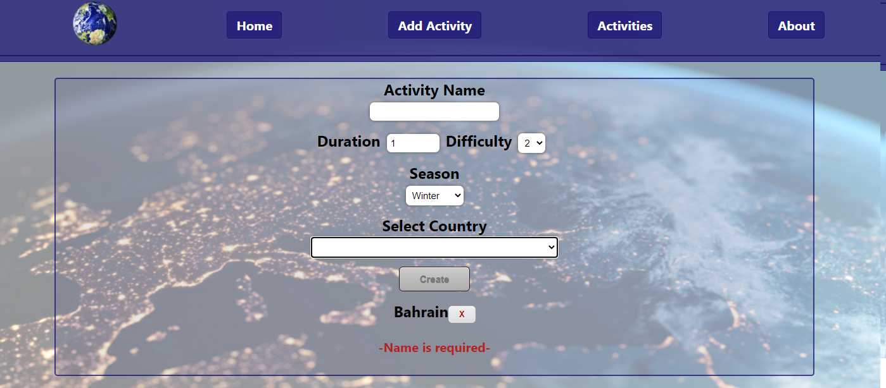

#  Countries App

  

## Intro

- Esta app fue realizada para la etapa "Proyecto Individual" de Labs del bootcamp Henry.
- Tiempo de desarrollo: 2 semanas. 

> Realizado utilizando el stack de tecnologías HTML, CSS, Javascript, React, Redux, Node.JS, Express, Sequelize y PostgreSQL.

## Home

  

- Muestra la lista completa de Paises en formato de tarjetas, cada una con su nombre, imagen y continente al que pertenece.
- Se realiza un paginando mostrando de a 9 tarjetas por página.
- Podemos filtrar países por continente, ordenar alfabéticamente, por cantidad de habitantes, de forma ascendente y descendente en ambos casos.

  

- El campo de búsqueda por nombre funciona reactivamente buscando en tiempo real (no se necesita presionar un botón) y devuelve la tarjeta de los países que incluyan en su nombre la cadena de caracteres que ingresamos.
- Al pie de la pantalla tenemos el paginado con botones que se activan únicamente cuando son necesarios.
- Si hacemos click sobre cualquier tarjeta nos redirige a los detalles de ese país.

  

- Posee un formulario controlado donde ingresamos los datos necesarios para crear una nueva actividad para vinculada a uno o más países.

- A medida que completamos los campos, en la parte inferior de la pantalla nos muestra si hay errores.

  

- El botón para Crear solo se habilita cuando todos los campos son cargados correctamente.

  

- Las actividades creadas pueden ser vistas en su correspondiente tarjeta, la cual muestra todos los detalles de la misma, incluyendo la bandera del país junto con su nombre, al darle click nos redirige a una vista con los detalles de ese país.

  

